# C4 — Level 3: Components

> Generated by Reversa Architect · 2026-05-17
> Confidence: 🟢 CONFIRMED | 🟡 INFERRED
> Scope: Static Site container — the only runtime container

---

## Diagram

```mermaid
C4Component
    title Component Diagram — Static Site (fullstack-profile)

    Container_Boundary(static_site, "Static Site (Browser Runtime)") {

        Component(page_gabriel, "gabriel.tsx", "React Page", "Main page orchestrator. Manages loading state (Pace.js gate), windowProps (aspect-ratio breakpoint), and renders HeroSection + HeroDark + MainContent conditionally.")

        Component(page_index, "pages/index.ts", "Next.js Page", "Thin redirect page. Mounts useRedirect hook to detect browser locale and push to /[locale]/dev/gabriel-toshinori-nakano/")

        Component(hero_section, "HeroSection", "React Component (GSAP)", "Full-viewport animated mountain landscape. WideScreen: 10-layer GSAP ScrollTrigger parallax + sticky menu. Mobile: static mountain image. Includes CTA button to 3-3-3 article.")

        Component(hero_dark, "HeroDark", "React Component (GSAP)", "Dark profile section. Manages tab state machine (job/projects/partner). Hosts photo carousel (ScrollTrigger) and sticky menu expansion.")

        Component(jobs, "Jobs", "React Component", "Work history timeline (5 jobs from jobs.json, reversed to newest-first) + 2 hardcoded education entries. hasEducation toggle. Day.js for date formatting.")

        Component(projects, "Projects", "React Component (Lodash)", "Accordion of 19 projects (toshi-projects.json, reversed). expanded[] state array. toggleByLabel / toggleAll. ⚠️ Duplicate label bug.")

        Component(future_partner, "FuturePartner", "React Component (JSX — not TS)", "Recruiter message panel. Fully i18n'd (all 3 locales). useTranslation hook. No state, purely presentational.")

        Component(main_content, "MainContent / Introduction", "React Component", "'3-3-3 Principles for a Better UX' article. English only. ~630 lines. Non-functional social links at bottom.")

        Component(analytics, "Analytics / GoogleAnalytics", "React Component", "Wraps GA4 script injection. Production-only gate. Provides ga.ts helpers for custom events: menu_click, hero_cta.")

        Component(layout_public, "layout/Public", "Next.js Layout", "Page shell: <Head> with meta/fonts/CDN scripts (Pace.js, Unicons). Wraps all pages.")

        Component(change_language, "ChangeLanguage", "React Component", "Locale switcher widget. router.push with prefix prepend. Supports en, ja, pt-BR.")

        Component(use_redirect, "useRedirect", "React Hook", "Browser locale detection on mount. next-language-detector → router.push to /[locale]/... Includes /404 guard.")

        Component(prefix_helper, "prefix.ts", "Helper", "Returns NEXT_PUBLIC_BASE_PATH (/fullstack-profile in prod, empty in dev). Used by all asset URLs and router.push calls.")

        Component(custom_loader, "customLoader.ts", "Next.js Image Loader", "Identity function — returns src unchanged. Bypasses Next.js image optimization for static export compatibility.")
    }

    ComponentDb(json_data, "JSON Data", "src/data/*.json", "jobs, projects, stacks, swtools")
    ComponentDb(locales, "Translation Files", "public/locales/*/common.json", "en, ja, pt-BR")
    System_Ext(pace, "Pace.js CDN", "Fires 'done' event on load complete")
    System_Ext(ga4, "Google Analytics 4", "Receives tracking events")

    Rel(page_gabriel, hero_section, "Renders (conditional on !loading)")
    Rel(page_gabriel, hero_dark, "Renders (conditional on !loading)")
    Rel(page_gabriel, main_content, "Renders (conditional on !loading)")
    Rel(page_gabriel, analytics, "Renders")
    Rel(page_gabriel, pace, "Listens for 'done' event", "Pace.on()")

    Rel(page_index, use_redirect, "Mounts")
    Rel(use_redirect, prefix_helper, "Uses for router.push path")

    Rel(hero_section, prefix_helper, "Uses for image asset URLs")
    Rel(hero_section, custom_loader, "Uses for <Image> loader prop")

    Rel(hero_dark, jobs, "Renders in 'job' tab")
    Rel(hero_dark, projects, "Renders in 'projects' tab")
    Rel(hero_dark, future_partner, "Renders in 'partner' tab")
    Rel(hero_dark, analytics, "Fires menu_click event on tab change")

    Rel(jobs, json_data, "Imports jobs.json")
    Rel(projects, json_data, "Imports toshi-projects.json")

    Rel(layout_public, change_language, "Renders in header area")
    Rel(change_language, prefix_helper, "Uses for router.push path")
    Rel(change_language, locales, "Reads current locale from router")

    Rel(future_partner, locales, "useTranslation — all 3 locales")

    Rel(analytics, ga4, "Sends events", "gtag()")
```

---

## Component Responsibility Summary

| Component | Responsibility | State? | i18n? | External deps |
|-----------|---------------|--------|-------|---------------|
| `gabriel.tsx` | Page orchestrator; loading gate; responsive breakpoint | `loading`, `windowProps` | No | Pace.js |
| `HeroSection` | Parallax hero; WideScreen/Mobile split | No (GSAP handles animation) | CTA string only | GSAP |
| `HeroDark` | Tab state machine; photo carousel | `selected`, `loading` | No | GSAP |
| `Jobs` | Work history timeline; education toggle | `hasEducation` | Yes | dayjs |
| `Projects` | Project accordion; expand/collapse | `expanded[]` | Yes | lodash |
| `FuturePartner` | Recruiter message | No | Yes (3 locales) | — |
| `Introduction` | 3-3-3 article | No | No (EN only) | — |
| `Analytics` | GA production gate | No | No | gtag.js |
| `ChangeLanguage` | Locale switcher | No | — | next/router, prefix |
| `useRedirect` | Browser locale detection + redirect | No | — | next-language-detector |
| `prefix.ts` | basePath string helper | No | No | env var |
| `customLoader.ts` | Image optimization bypass | No | No | — |
