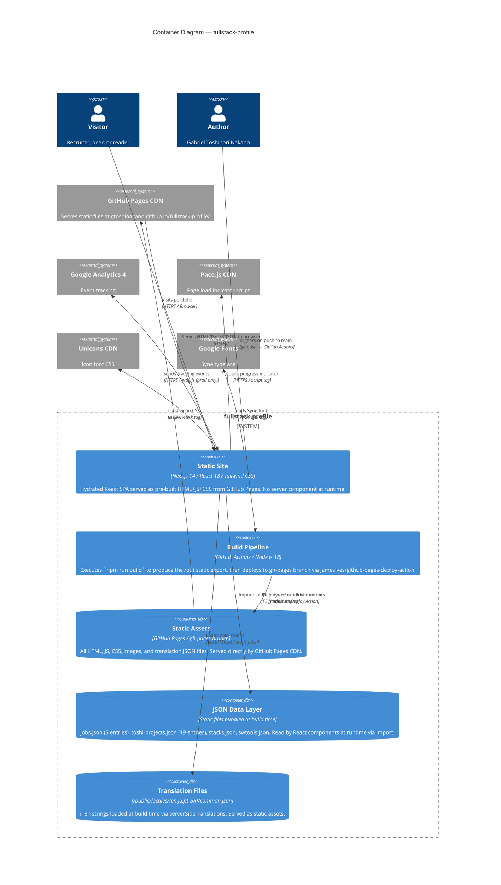

# C4 — Level 2: Containers

> Generated by Reversa Architect · 2026-05-17
> Re-extracted · 2026-05-20 (includes Feature 006 — Tech Stack Opinions)
> Confidence: 🟢 CONFIRMED | 🟡 INFERRED
>
> Note: Feature 006 is integrated into the Worker container (system prompt building with tech opinions). See `deployment-architecture.md` for detailed data flow.

---

## Diagram

---

## Container Detail

### Static Site
- **Technology:** Next.js 14 (Pages Router) + React 18.3 + TypeScript 5.4 (partial) + Tailwind CSS 3.4 + GSAP 3.12
- **Entry point:** `pages/[locale]/dev/gabriel-toshinori-nakano/gabriel.tsx`
- **Routing:** Static routes generated via `getStaticPaths` — 3 locales × 1 page = 3 HTML files
- **Redirect logic:** `pages/index.ts` → `useRedirect()` hook → browser locale detection → `router.push(/[locale]/dev/...)`
- **basePath:** `/fullstack-profile` (GitHub Pages sub-path, all asset URLs prepend `prefix`)

### Build Pipeline
- **Trigger:** Any push to `main` branch
- **Steps:** checkout → setup Node 18 → `npm ci` → `npm run build` → deploy `/out` to `gh-pages`
- **Build output:** `/out/` folder with 3 static HTML pages + all assets
- **No environment secrets** — only `NEXT_PUBLIC_BASE_PATH` (public, non-sensitive)

### JSON Data Layer
- **Location:** `src/data/` — imported directly by React components (not fetched at runtime)
- **No ORM, no migrations, no database** — plain JSON files edited by the author and committed
- **Known issue:** `toshi-projects.json` has 5 entries with duplicate `label: "requirement"` (see BR-07)

### Translation Files
- **Location:** `public/locales/{en,ja,pt-BR}/common.json`
- **Loading:** `serverSideTranslations` runs at `next build` time (despite the name — it's a build-time function in static export mode)
- **Coverage:** most UI strings translated; `Introduction.tsx` article is English-only
