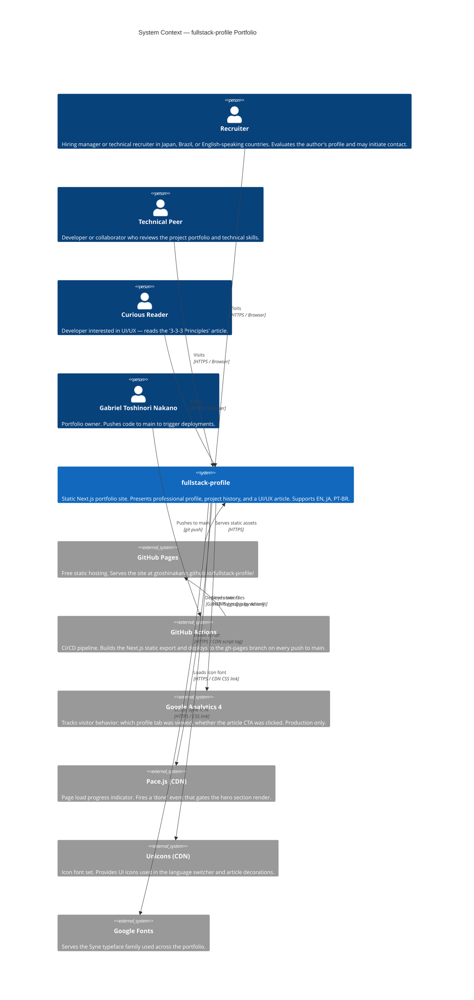

# C4 — Level 1: System Context

> Generated by Reversa Architect · 2026-05-17
> Re-extracted · 2026-05-20 (includes Feature 006 — Tech Stack Opinions)
> Confidence: 🟢 CONFIRMED | 🟡 INFERRED

---

## Diagram

---

## Personas Detail

| Persona | Primary Interaction | Language | Key Feature Used |
|---------|-------------------|----------|-----------------|
| Recruiter | Reviews work history, reads the recruiter message | JA / PT-BR / EN | Profile tab (Jobs), Message tab (FuturePartner) |
| Technical Peer | Reviews project accordion | EN | Projects tab |
| Curious Reader | Reads "3-3-3 Principles" article | EN (only) | MainContent article |
| Author | Deploys via git push | — | GitHub Actions pipeline |

---

## Notes

- 🟢 The portfolio has **no backend server** — all external calls are browser-to-CDN or browser-to-GA
- 🟢 GA4 is **production-only** — gated by `process.env.NODE_ENV === 'production'`
- 🟡 Pace.js is loaded from a CDN script tag in the `<head>` — no version pinning; a CDN outage would prevent the page from revealing content
- 🟡 Unicons CDN outage would degrade icon rendering but would not break functionality
