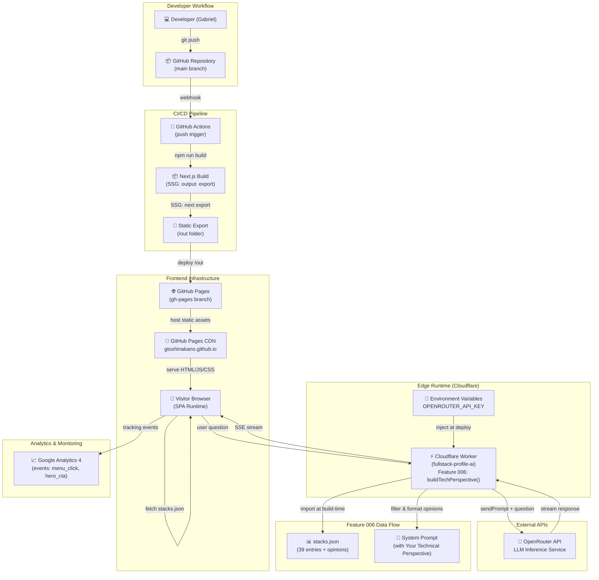

# Deployment Architecture — fullstack-profile

> Generated by Reversa Architect · 2026-05-20
> Includes: Frontend (GitHub Pages), Backend (Cloudflare Workers), Feature 006 Integration
> Confidence: 🟢 CONFIRMED

---

## Overview

The application is distributed across three deployment environments:

1. **Frontend:** Static Next.js export hosted on GitHub Pages
2. **Edge Runtime:** Cloudflare Workers for server-side logic
3. **External APIs:** OpenRouter for AI inference

---

## Deployment Diagram



---

## Component Interaction: Feature 006 + ToshiAITerminal

### Request Flow

```
1. Visitor asks: "What do you think about React?"
   ↓
2. ToshiAITerminal.tsx sends:
   POST /api/toshi-ai {question: "What do you think about React?"}
   ↓
3. Cloudflare Worker receives request:
   - CORS validation (Origin check)
   - Preflight handling (OPTIONS)
   - Build system prompt via buildSystemPrompt()
   ↓
4. buildSystemPrompt() calls buildTechPerspective():
   - Filters stacks: opinion && opinion.trim().length > 0
   - Formats: "React: React is my go-to for building interactive user interfaces..."
   - Inserts into system prompt after Technical Skills section
   ↓
5. Worker sends to OpenRouter:
   POST /api/v1/chat/completions {
     system: "[...system prompt including Your Technical Perspective...]",
     messages: [{role: "user", content: "What do you think about React?"}],
     stream: true
   }
   ↓
6. OpenRouter streams response via SSE
   ↓
7. Worker forwards SSE chunks to browser
   ↓
8. Browser parses and renders response in ToshiAITerminal UI
```

### System Prompt Sections (in order)

```
About Gabriel [static text]
Work History [from jobs.json]
Education [from jobs.json + hardcoded JSX]
Projects [from toshi-projects.json]
Technical Skills [enumerated stack names]
━━━━━━━━━━━━━━━━━━━━━━━━━━━━━━━
## Your Technical Perspective [Feature 006]
- React: [Gabriel's opinion on React]
- AWS: [Gabriel's opinion on AWS]
- [... 37 more stacks with opinions ...]
━━━━━━━━━━━━━━━━━━━━━━━━━━━━━━━
Hobbies [static text]
Dislikes [static text]
Instructions [prompt engineering rules]
```

---

## Data Flow: Build-Time vs. Runtime

| Phase | Data | Consumer | Purpose |
|-------|------|----------|---------|
| **Build-Time** (next build) | stacks.json + all data files | buildSystemPrompt() | Create system prompt string (frozen in worker bundle) |
| **Build-Time** | buildTechPerspective(stacks) | systemPrompt.ts | Filter & format opinions; concatenate into prompt |
| **Runtime** (visitor request) | User question | OpenRouter API | AI inference with opinion-enriched system prompt |
| **Runtime** | System prompt (pre-built) | LLM inference | Context for AI response about Gabriel's perspectives |

---

## Deployment Environments

### Production

```
Frontend: gtoshinakano.github.io/fullstack-profile
           (GitHub Pages, static export)

Worker:    fullstack-profile-ai (Cloudflare Workers)
           env: OPENROUTER_API_KEY (secure)
           
Analytics: GA4 Measurement ID G-RH74DXLKZL (production-only)
           
TLD:       1 instance serves both main and dev routes
```

### Development

```
Frontend:  http://localhost:3000
           (next dev, SSR mode)

Worker:    http://localhost:8787
           (wrangler dev)
           env: OPENROUTER_API_KEY (local .wrangler.toml)

Analytics: Disabled (NODE_ENV !== 'production')
```

---

## Feature 006 Architectural Decisions

### Why Opinions Built at Build-Time

✅ **Pros:**
- System prompt is static and immutable after deployment
- No runtime fetch overhead for opinions data
- Opinions frozen in deployed worker version (auditable history)
- Simpler error handling: missing/null opinions filtered at build, not at runtime

❌ **Cons:**
- Requires redeploy to change opinion (no live updates)
- Opinions bundled in worker code

### Why Frontend Never Accesses Opinions

✅ **Pros:**
- Zero browser bundle impact (opinions not shipped to client)
- Clear separation: frontend renders UI, worker provides AI context
- Opinions never leak in HTML/CSS/DOM

❌ **Cons:**
- Visitors cannot see opinions without asking AI
- Opinions not searchable in page (SEO impact: minimal)

### Why Server-Side Only

✅ **Pros:**
- Opinions are AI-context only (single purpose)
- No additional API endpoint needed (buildSystemPrompt() runs during request)
- Backward compatible: old worker code ignores missing opinion field

❌ **Cons:**
- Coupling: system prompt complexity grows with stack count (39 stacks = ~1500 tokens)

---

## Monitoring & Observability

| Signal | Source | Threshold | Action |
|--------|--------|-----------|--------|
| Worker errors | Cloudflare Logs | > 1% error rate | Page oncall |
| OpenRouter API errors | HTTP status codes | Timeouts, 429s | Graceful degradation; inform visitor |
| System prompt size | buildSystemPrompt() length | > 3000 tokens | Consider splitting opinions |
| GA tracking | Custom events | Anomalies in menu_click / hero_cta | Investigate visitor behavior change |

---

## Security Considerations

| Layer | Control | Status |
|-------|---------|--------|
| **Frontend** | CORS: origin check in Worker | ✅ Enforced |
| **Worker** | API key injection via env var | ✅ Secure (never exposed to browser) |
| **OpenRouter** | Bearer token in Authorization header | ✅ Secure (HTTPS only) |
| **Data** | stacks.json opinions are public text (no PII) | ✅ No sensitive data |

---

## Scalability

| Component | Limit | Current Usage | Headroom |
|-----------|-------|---------------|----------|
| GitHub Actions build time | — | ~2–3 min | Good |
| Cloudflare Worker timeout | 30 sec (default) | ~5–10 sec (OpenRouter latency) | Good |
| System prompt size | OpenRouter context window | ~2000 tokens (system + question) | Good (up to 100k tokens available) |
| stacks.json entries | No limit | 39 | Good |
| Opinions per stack | No limit | 1–3 sentences | Good (~50–200 chars per opinion) |

---

## Disaster Recovery

| Failure Scenario | Detection | Mitigation |
|------------------|-----------|-----------|
| OpenRouter API down | Worker receives error | Worker returns 500; frontend shows error message |
| Cloudflare Worker down | Browser cannot reach endpoint | ToshiAITerminal is disabled; UI remains functional |
| GitHub Pages down | DNS or HTTP 404 | Site inaccessible; users redirected by browser or ISP |
| Corrupted stacks.json | Build-time error | Build fails; previous deployment remains live |
| Missing opinions (BR-14 violation) | Regression watch W001 | Next `/reversa` re-extraction detects; alerts user |

---

## Feature 006 Deployment Checklist

- ✅ All 39 stacks have non-empty opinion field
- ✅ buildTechPerspective() function implemented and tested
- ✅ System prompt includes "Your Technical Perspective" section
- ✅ Frontend isolation verified (zero opinion references in src/components/)
- ✅ Backward compatibility confirmed (missing opinion field gracefully filtered)
- ✅ Worker environment variables set (OPENROUTER_API_KEY)
- ✅ Build pipeline verified (next build succeeds with new stacks schema)
- ✅ Regression watch items documented (W001–W005 all passing)
- ✅ ADR-006 documented and approved

---

## Related Documentation

- **Architecture:** `_reversa_sdd/architecture.md`
- **Domain Rules:** `_reversa_sdd/domain.md` (BR-14: opinions server-side only)
- **Decision Records:** `_reversa_sdd/adrs/006-tech-stack-opinions.md`
- **Data Model:** `_reversa_sdd/erd-complete.md` (STACK entity with opinion field)
- **Code Analysis:** `_reversa_sdd/code-analysis.md` (Module 8: Worker integration)
