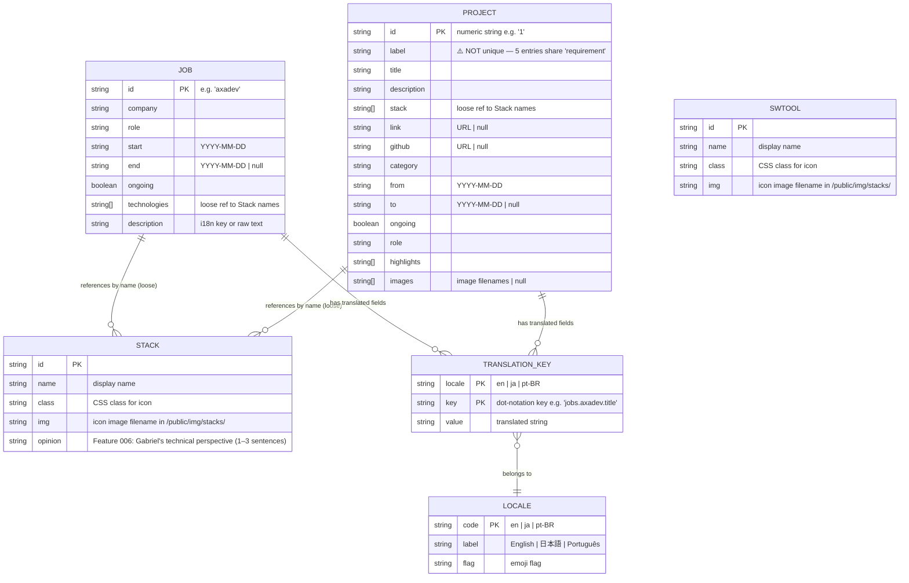

# ERD — Complete Data Dictionary

> Generated by Reversa Architect · 2026-05-17
> Re-extracted · 2026-05-20 (includes Feature 006 — Tech Stack Opinions)
> Confidence: 🟢 CONFIRMED | 🟡 INFERRED
>
> Note: This project has **no database**. The ERD models the static JSON data layer (files in `src/data/` and `public/locales/`). Relationships are loose (string references) — there are no foreign keys or enforced constraints.

---

## Entity-Relationship Diagram

---

## Entity Notes

### JOB
- **Source:** `src/data/jobs.json`
- **Count:** 5 entries
- **Order:** Stored oldest-first; `_.reverse()` applied in `Jobs.tsx` for newest-first display
- **Education:** Not in this file — 2 education entries are hardcoded JSX in `Jobs.tsx` (BR-05)
- **Ongoing jobs:** `ongoing: true` entries have no `end` date; displayed with "present" badge

### PROJECT
- **Source:** `src/data/toshi-projects.json`
- **Count:** 19 entries
- **Order:** Stored oldest-first; `_.reverse()` applied in `Projects.tsx` for newest-first display
- **⚠️ Duplicate label bug:** 5 entries share `label: "requirement"` — accordion expand/collapse affects all 5 simultaneously (BR-07)
- **images field:** Present on some entries but not rendered in current UI — 🟡 possibly dead field or future feature

### STACK / SWTOOL
- **Sources:** `src/data/stacks.json`, `src/data/swtools.json`
- **Schema (STACK):** 5 fields: id (PK), name, class, img, **opinion** *(Feature 006, added 2026-05-20)*
- **Schema (SWTOOL):** 4 fields (identical to pre-Feature 006 STACK: id, name, class, img)
- **Usage:** 
  - Frontend: Rendered as icon grids in the HeroDark section (Projects, Jobs tabs); accesses `id`, `name`, `class`, `img` only
  - Worker: `buildTechPerspective()` function iterates STACK entries, filters non-empty `opinion` field, includes formatted opinions in AI system prompt
- **Opinion Field (Feature 006):**
  - Required: all 39 stacks populated with authentic Gabriel commentary
  - Validation: `opinion && opinion.trim().length > 0`
  - Visibility: Server-side only (never exposed to frontend browser)
  - Consumer: Cloudflare Worker system prompt building exclusively
- **Relationship to JOB/PROJECT:** Jobs and Projects reference stack names as plain strings — no enforced FK

### TRANSLATION_KEY
- **Source:** `public/locales/{en,ja,pt-BR}/common.json`
- **Loading:** Built into JS bundles at `next build` time via `serverSideTranslations`
- **Coverage gap:** `Introduction.tsx` article is not internationalized — no translation keys exist for its content

### LOCALE
- **Supported:** `en`, `ja`, `pt-BR`
- **Default:** `en` (detected by `next-language-detector` if browser preference not matched)
- **Route:** All content served under `/[locale]/dev/gabriel-toshinori-nakano/`

---

## Cardinality Summary

| Relationship | Type | Notes |
|-------------|------|-------|
| JOB → STACK | many-to-many (loose) | `technologies[]` string array, not FK |
| PROJECT → STACK | many-to-many (loose) | `stack[]` string array, not FK |
| JOB → TRANSLATION_KEY | one-to-many | Each job has translated title/description per locale |
| PROJECT → TRANSLATION_KEY | one-to-many | Each project has translated content per locale |
| LOCALE → TRANSLATION_KEY | one-to-many | Each locale file contains N keys |

---

## Data Volume

| Entity | Count | Growth pattern | Feature 006 Updates |
|--------|-------|----------------|-------------------|
| JOB | 5 | Author-managed; new entry per career move | No change |
| PROJECT | 19 | Author-managed; new entries as projects ship | No change |
| STACK | 39 | Author-managed; new tech stack entries | Added `opinion` field to all 39 entries |
| SWTOOL | ~15 | Author-managed; rarely changes | No change |
| TRANSLATION_KEY (per locale) | ~34 in common.json | Grows with new UI strings | No change |
| LOCALE | 3 | Fixed (en, ja, pt-BR) | No change |
