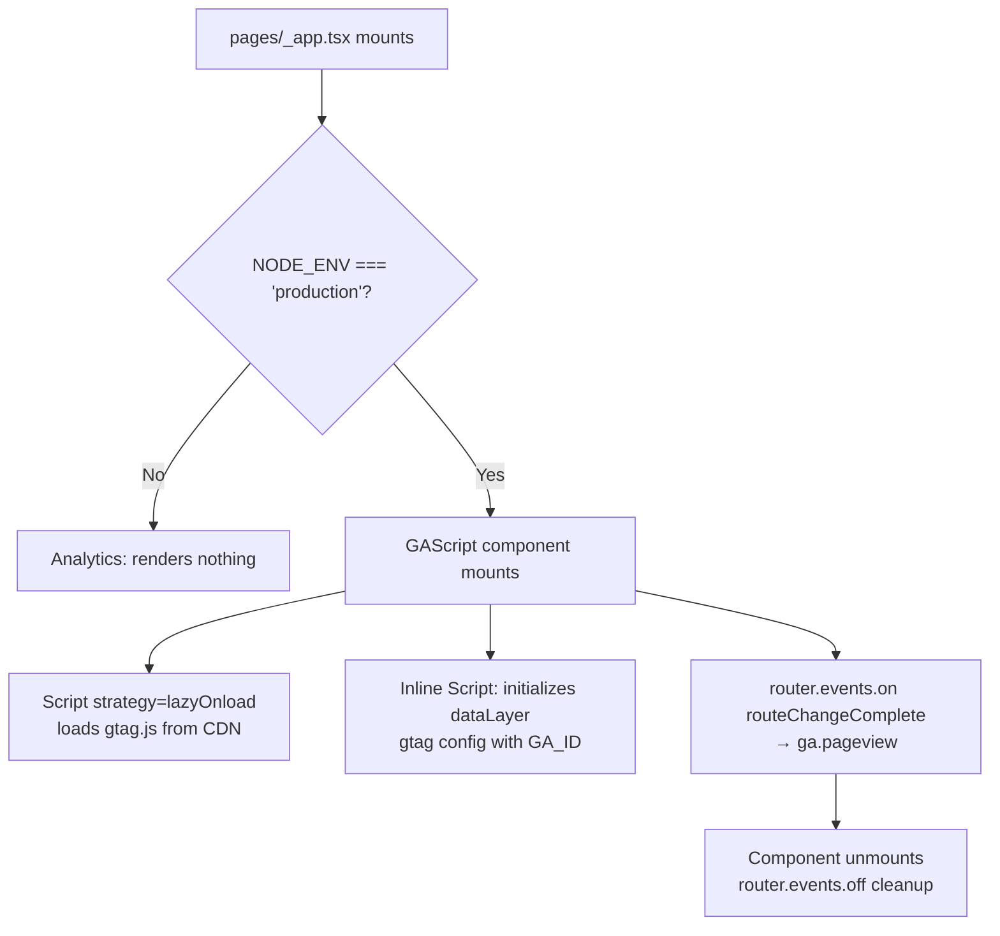

# Flowchart — analytics

> Generated by Reversa Archaeologist · 2026-05-17

## GA Initialization



## Custom Event Flow

```mermaid
flowchart LR
    A[User interaction] --> B{Event type}
    B -->|Menu tab click| C[ga.event\naction: menu_click\ncategory: job|projects|partner]
    B -->|Hero CTA click| D[ga.event\naction: hero_cta\ncategory: 3-3-3 Principle\nlabel: widescreen|mobile screen]
    C --> E[window.gtag event]
    D --> E
    E --> F{window.gtag defined?}
    F -->|Yes| G[Send to GA4]
    F -->|No| H[Silent no-op]
```
