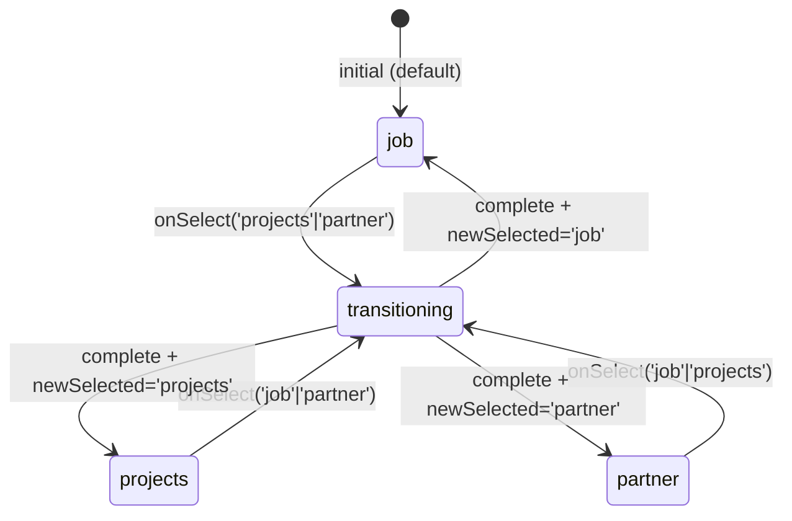
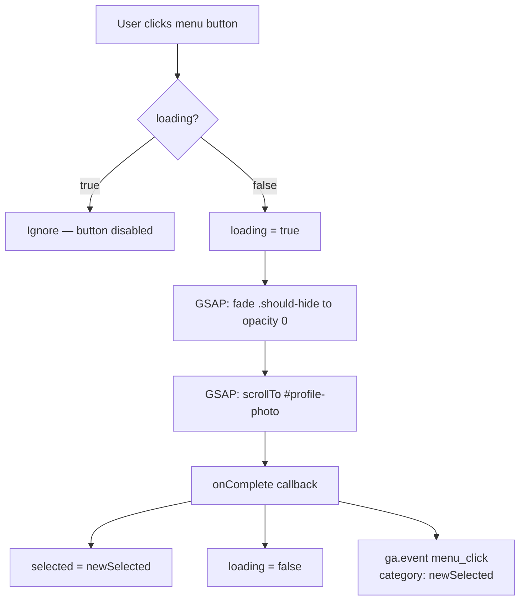
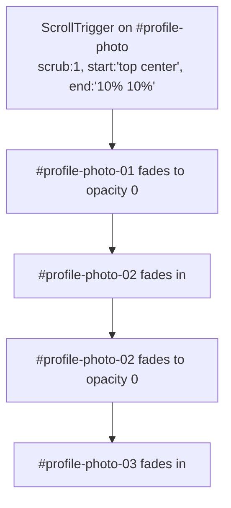
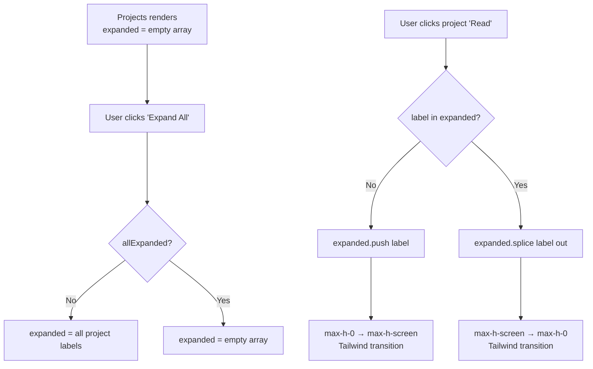
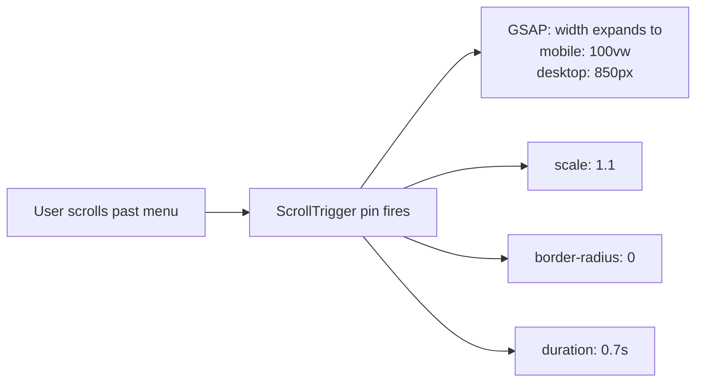

# Flowchart — hero-dark

> Generated by Reversa Archaeologist · 2026-05-17

## Tab Selection State Machine

## onSelect() Flow

## Profile Photo Carousel (ScrollTrigger)

## Projects Accordion State

## Menu Sticky Expansion (ScrollTrigger)

