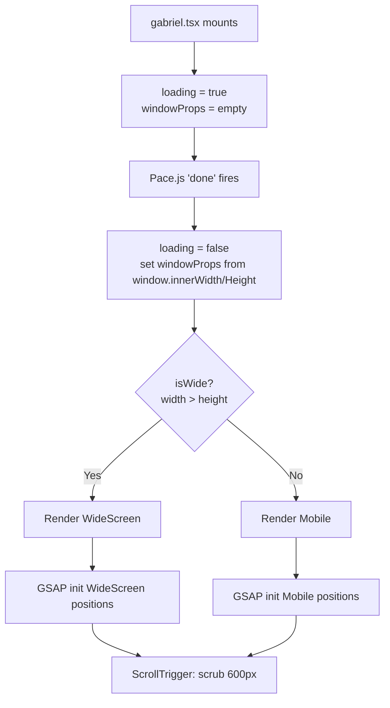
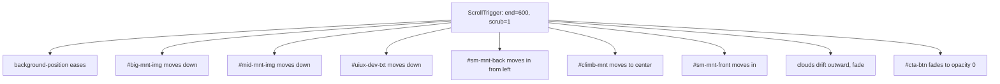

# Flowchart — hero-section

> Generated by Reversa Archaeologist · 2026-05-17

## Render Decision (parent: gabriel.tsx)



## GSAP Parallax Layer Timeline (WideScreen / Mobile)



## CTA Button Action

```mermaid
flowchart LR
    A[User clicks CTA button] --> B[gsap.to window scrollTo 'main']
    A --> C[ga.event hero_cta\ncategory: '3-3-3 Principle'\nlabel: 'widescreen'|'mobile screen']
```
