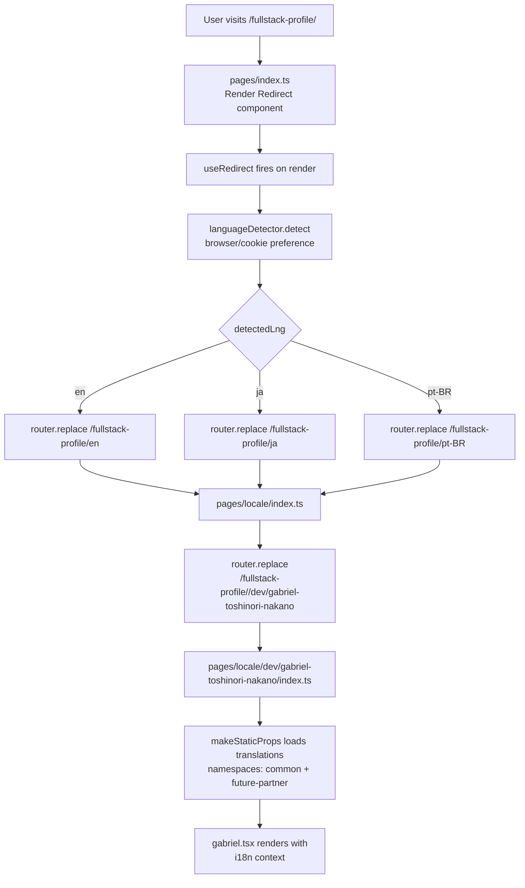
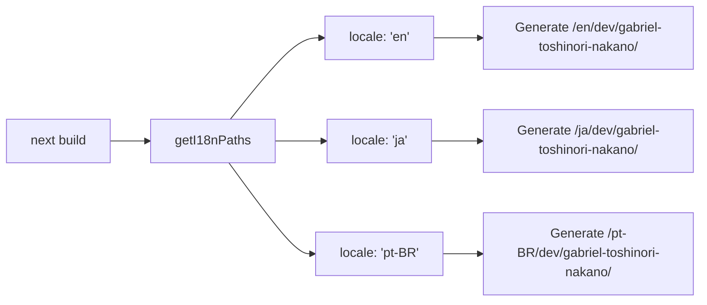
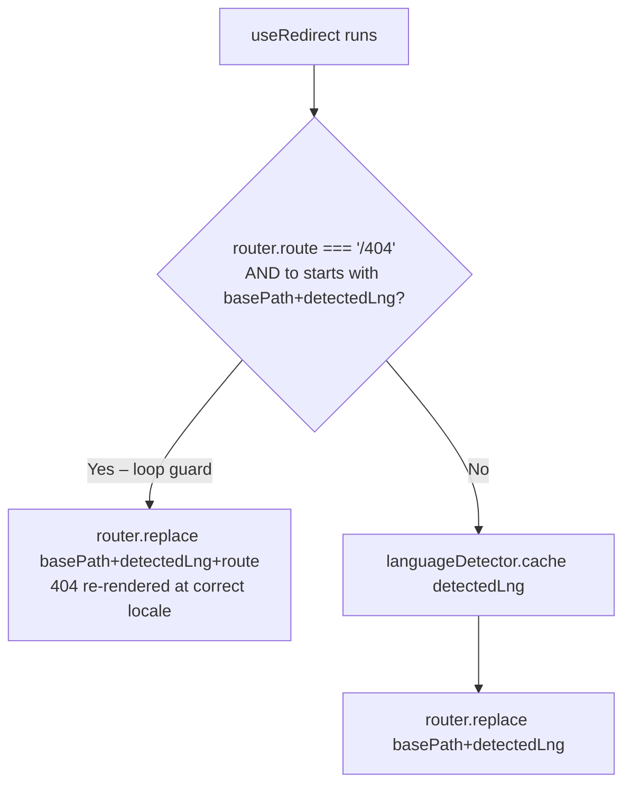

# Flowchart — i18n

> Generated by Reversa Archaeologist · 2026-05-17

## Route-Based Locale Detection & Redirect

```mermaid
flowchart TD
    A[User visits /fullstack-profile/] --> B[pages/index.ts\nRender Redirect component]
    B --> C[useRedirect fires on render]
    C --> D[languageDetector.detect\nbrowser/cookie preference]
    D --> E{detectedLng}
    E -->|en| F[router.replace /fullstack-profile/en]
    E -->|ja| G[router.replace /fullstack-profile/ja]
    E -->|pt-BR| H[router.replace /fullstack-profile/pt-BR]
    F --> I[pages/locale/index.ts]
    G --> I
    H --> I
    I --> J[router.replace\n/fullstack-profile/<locale>/dev/gabriel-toshinori-nakano]
    J --> K[pages/locale/dev/gabriel-toshinori-nakano/index.ts]
    K --> L[makeStaticProps loads translations\nnamespaces: common + future-partner]
    L --> M[gabriel.tsx renders with\ni18n context]
```

## getStaticPaths — Static Export Generation

```mermaid
flowchart LR
    A[next build] --> B[getI18nPaths]
    B --> C[locale: 'en']
    B --> D[locale: 'ja']
    B --> E[locale: 'pt-BR']
    C --> F[Generate /en/dev/gabriel-toshinori-nakano/]
    D --> G[Generate /ja/dev/gabriel-toshinori-nakano/]
    E --> H[Generate /pt-BR/dev/gabriel-toshinori-nakano/]
```

## Loop Guard in useRedirect

```mermaid
flowchart TD
    A[useRedirect runs] --> B{router.route === '/404'\nAND to starts with basePath+detectedLng?}
    B -->|Yes – loop guard| C[router.replace basePath+detectedLng+route\n404 re-rendered at correct locale]
    B -->|No| D[languageDetector.cache detectedLng]
    D --> E[router.replace basePath+detectedLng]
```
