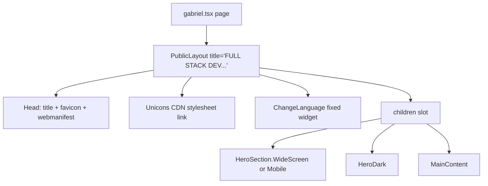
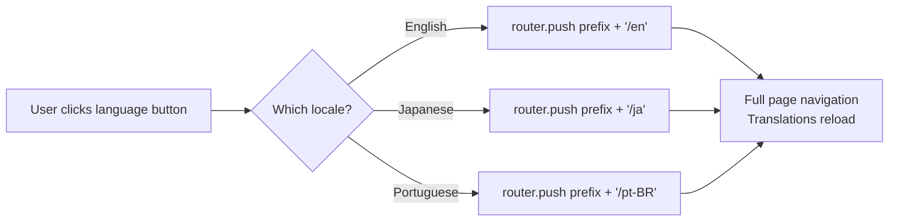
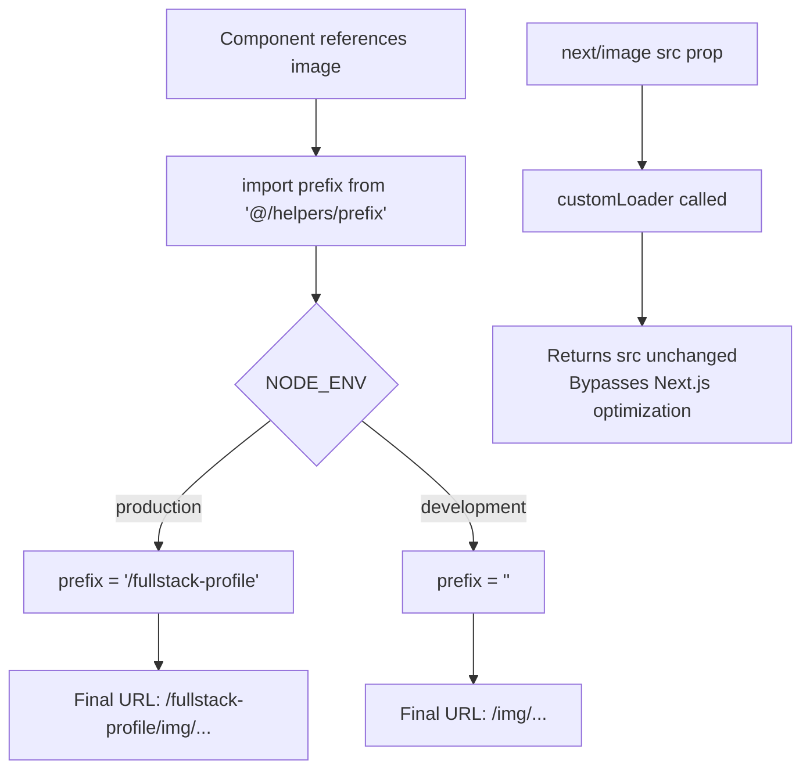
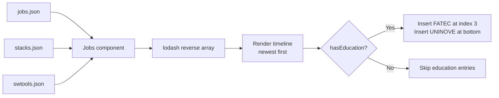

# Flowchart — layout & data

> Generated by Reversa Archaeologist · 2026-05-17

## Page Assembly



## ChangeLanguage Navigation



## Asset Path Resolution



## Data Flow: Jobs Tab



## Data Flow: Projects Tab

```mermaid
flowchart LR
    A[toshi-projects.json] --> B[Projects component]
    C[stacks.json] --> B
    B --> D[lodash reverse array]
    D --> E[Render accordion list\nnewest first]
    E --> F{label in expanded[]}
    F -->|Yes| G[max-h-screen\nshow detail]
    F -->|No| H[max-h-0\nhide detail]
```
