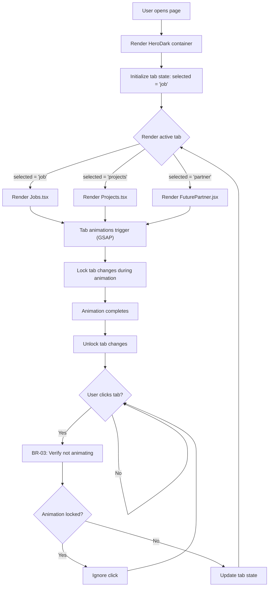
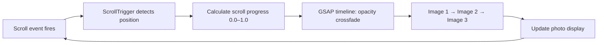
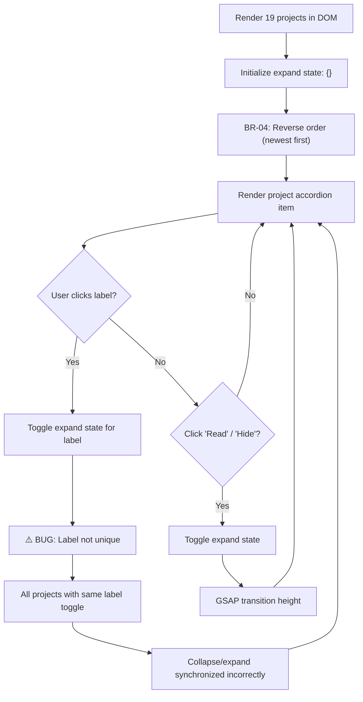
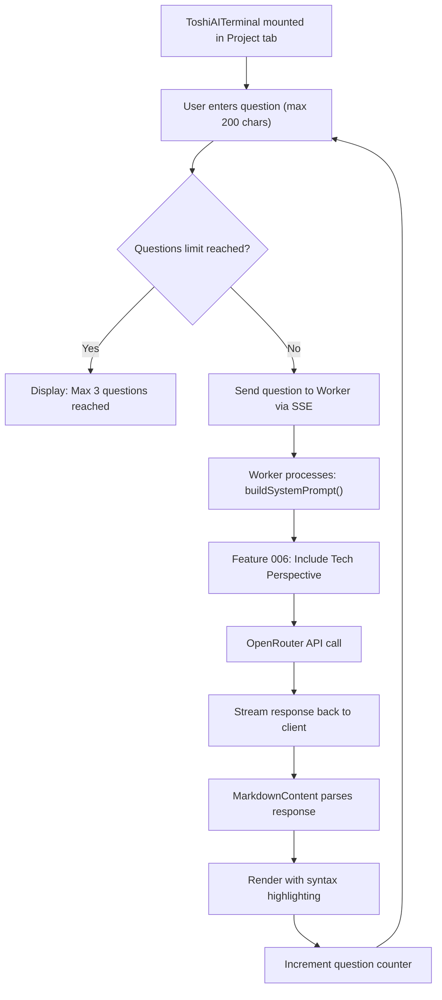

# Flowchart: Module 2 — hero-dark

> Tab state machine, photo carousel, projects accordion, ToshiAITerminal integration

---

## Tab State Machine (hero-dark/index.tsx)

---

## Photo Carousel (Scroll-Driven GSAP)

---

## Projects Accordion (Projects.tsx)

---

## ToshiAITerminal Integration

---

## Data Flow: Stacks → System Prompt (Feature 006)

```mermaid
graph LR
    A["stacks.json\n39 entries with opinion field"] --> B["worker/src/systemPrompt.ts\nbuiltSystemPrompt()"]
    B --> C["buildTechPerspective\nFilter non-empty opinions"]
    C --> D["Format: 'Stack: opinion' prose"]
    D --> E["Insert after\nTechnical Skills section"]
    E --> F["System prompt sent to OpenRouter"]
    F --> G["AI context enriched\nwith Gabriel's perspectives"]
    G --> H["ToshiAITerminal response\nincorporates opinions"]
```

---

## State Transitions Summary

| State | Transition | Condition |
|-------|-----------|-----------|
| `selected = 'job'` | → `'projects'` | Not animating + tab clicked |
| `selected = 'projects'` | → 'partner'` | Not animating + tab clicked |
| `selected = 'partner'` | → `'job'` | Not animating + tab clicked |
| Animation locked | → Unlocked | Animation duration elapsed |
| Question count < 3 | → Question sent | User submits form |
| Question count ≥ 3 | → Max reached | No further questions accepted |
