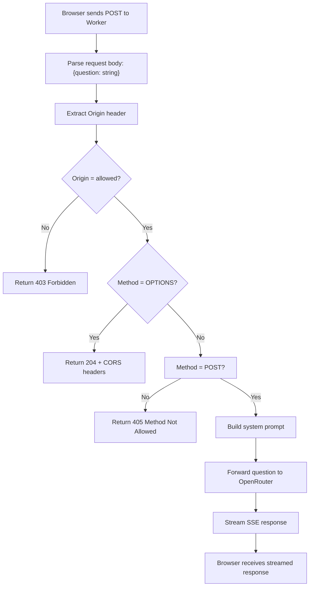
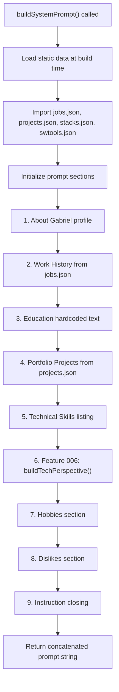
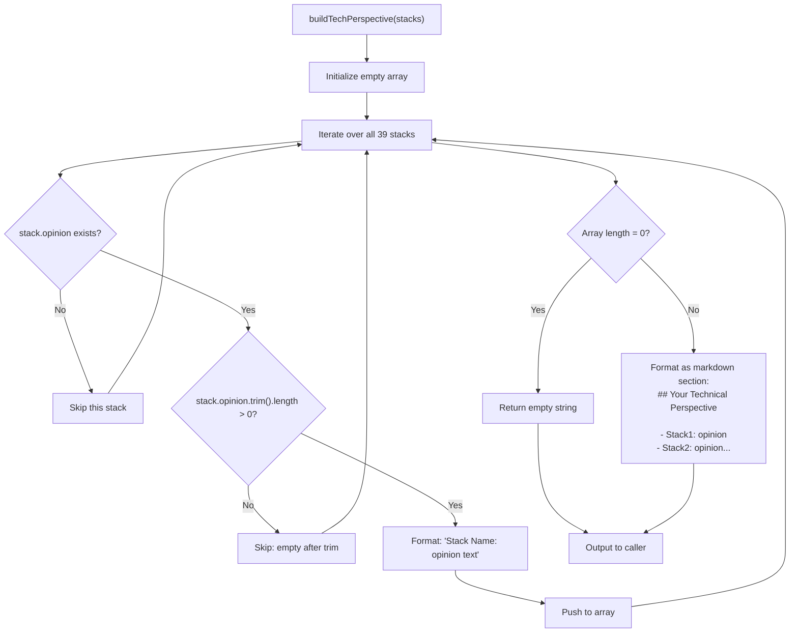
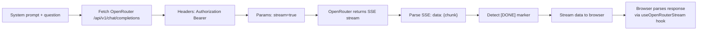
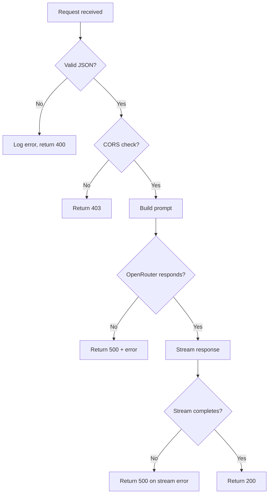

# Flowchart: Module 8 — Cloudflare Worker

> System prompt builder, OpenRouter proxy, Feature 006 integration

---

## Worker Request Lifecycle



---

## System Prompt Building Pipeline (buildSystemPrompt)



---

## Feature 006: buildTechPerspective() Function



---

## OpenRouter API Integration



---

## Data Transformations

| Source | Transformation | Destination |
|--------|---|---|
| jobs.json | Format: "Company (Period): [stacks]" | System prompt work history |
| toshi-projects.json | Sort newest-first, extract title + stacks | System prompt projects list |
| stacks.json | Filter non-empty `opinion`, format | System prompt "Your Technical Perspective" section |
| User question | Trim whitespace, validate | OpenRouter request |

---

## Error Handling



---

## Build-Time vs. Runtime

| Phase | Action | Data |
|-------|--------|------|
| **Build-time** | Import JSON, concat into buildSystemPrompt() | jobs, projects, stacks, swtools |
| **Runtime** | Receive question, call buildSystemPrompt() | User input only |
| **Feature 006** | buildTechPerspective() runs at build-time, opinions frozen in deployed prompt | 39 opinions as constant |

---

## Backward Compatibility (Feature 006)

```mermaid
graph TD
    A["Old deployment: no opinion field in stacks.json"]
    B["New code: buildTechPerspective() called"]
    
    A --> C["stack.opinion = undefined"]
    B --> D["Filter: stack.opinion && ..."} 
    D --> E["Condition fails"]
    E --> F["Stack skipped gracefully"]
    F --> G["System prompt = standard version"]
    
    H["New deployment: all stacks have opinion"]
    I["buildTechPerspective() called"]
    H --> J["stack.opinion = 'authentic text'"]
    I --> K["Filter: stack.opinion && ..."]
    K --> L["Condition passes"]
    L --> M["Stack opinion included"]
    M --> N["System prompt = enriched version"]
```
