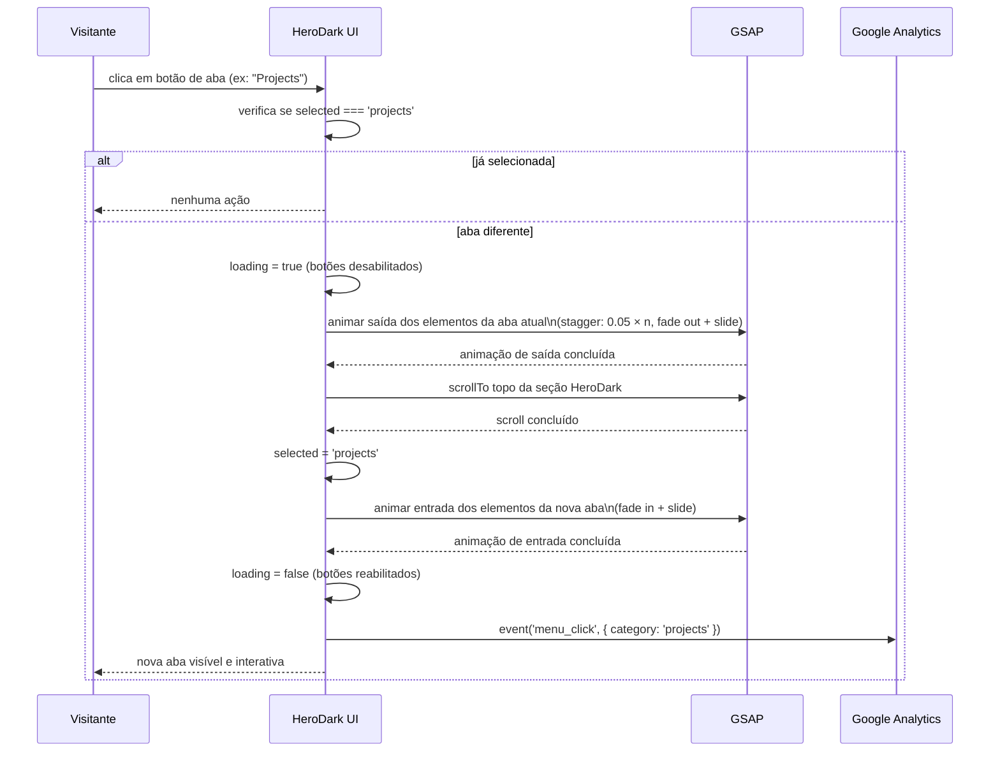
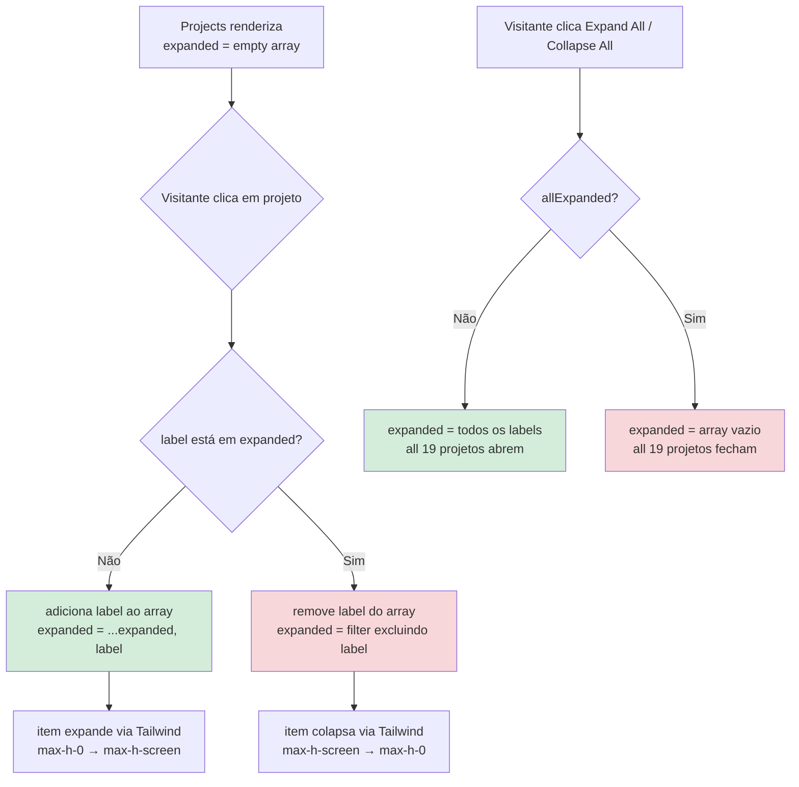
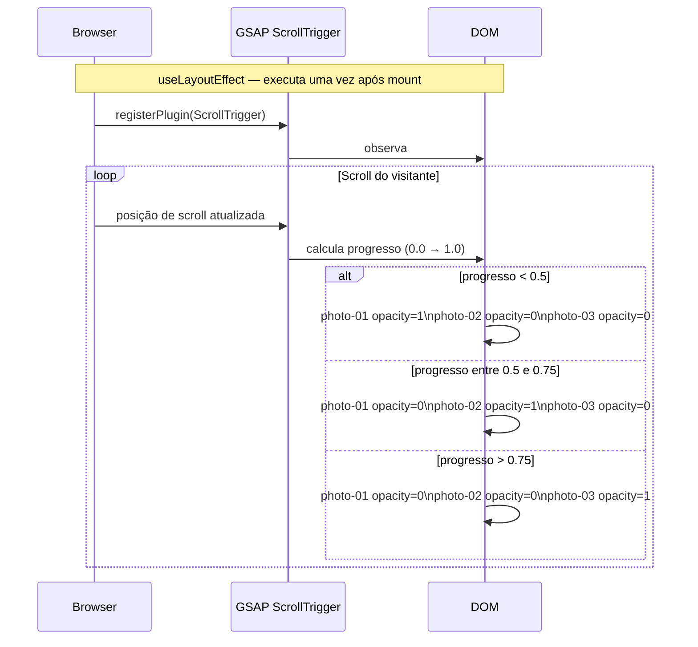
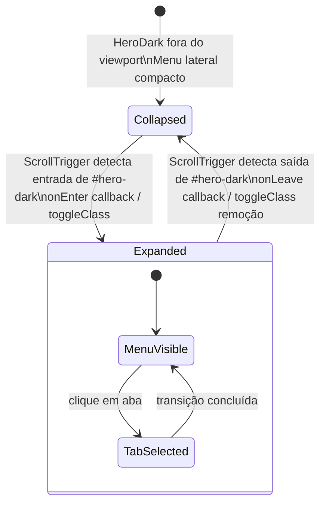

# Hero Dark — Fluxos Detalhados

> Arquivo opcional gerado por Reversa Writer · 2026-05-17
> Documenta os 4 fluxos distintos da unit que não cabem completamente no design.md.
> Confidence: 🟢 CONFIRMADO | 🟡 INFERIDO

---

## Fluxo 1 — Máquina de Estado de Abas



**Estados possíveis de `selected`:** `'job'` | `'projects'` | `'partner'`
**Estado inicial:** `'job'`
**Invariante:** `loading=true` e `loading=false` nunca ocorrem simultaneamente em duas transições (não há fila de transições — a trava impede enfileiramento).

---

## Fluxo 2 — Accordion de Projetos



**⚠️ Bug BR-07:** Quando `label="requirement"` é adicionado ao `expanded[]`, todos os 5 projetos com esse label são exibidos como expandidos (`expanded.includes(label)` retorna `true` para todos). A correção requer migrar o estado para usar `id` numérico em vez de `label` string.

**Transição CSS (sem GSAP):**
```css
/* Tailwind classes aplicadas condicionalmente */
max-h-0 overflow-hidden transition-all duration-300   /* colapsado */
max-h-screen overflow-hidden transition-all duration-300  /* expandido */
```

---

## Fluxo 3 — Carrossel de Fotos (ScrollTrigger)



**Fotos em sequência:**
1. `gabriel-photo.png` — foto profissional
2. `gabriel-github.png` — avatar do GitHub
3. `gabriel-photo.jpg` — foto profissional alternativa

**Nota:** `scrub:1` significa que o ScrollTrigger usa 1 segundo de "suavização" ao seguir o scroll — não é sincronização frame-a-frame imediata, o que gera um leve lag intencionalmente suave.

---

## Fluxo 4 — Menu Sticky (Expansão ao Entrar na Seção)



**Implementação inferida** 🟡 — o mecanismo exato (GSAP `toggleClass`, `onEnter`/`onLeave` ou classe CSS adicionada via JS) não foi confirmado com leitura linha a linha do componente. O comportamento observável é: o menu se expande ao entrar na seção `#hero-dark` e se contrai ao sair.

**Sem estado React** — a expansão é puramente visual, controlada por CSS class toggle via GSAP. Nenhum `useState` é usado para este comportamento.
