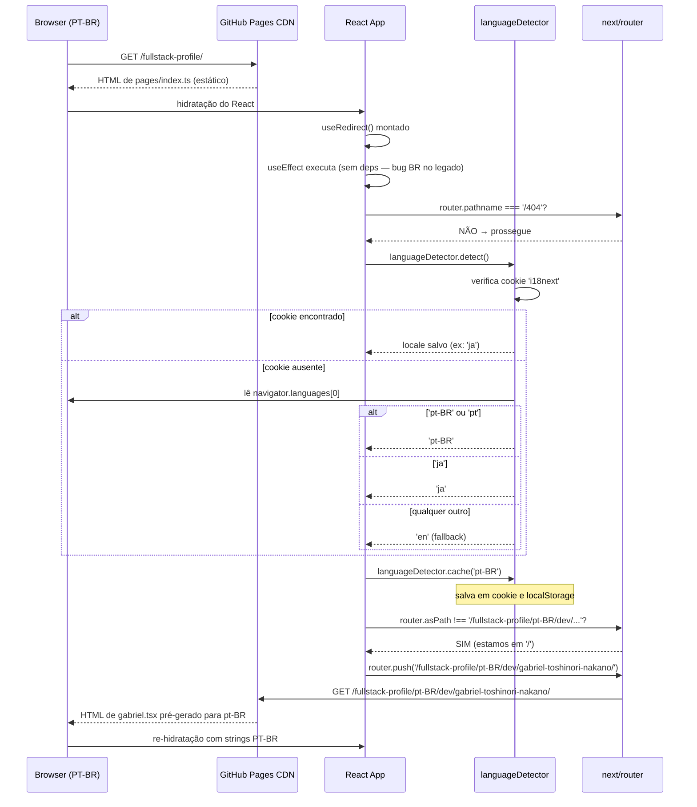
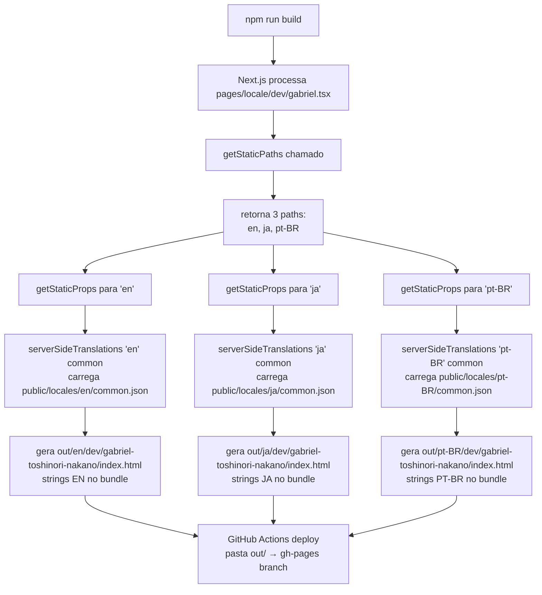
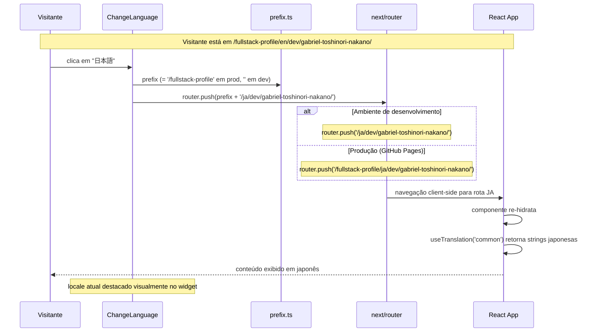

# i18n — Fluxos Detalhados

> Arquivo opcional gerado por Reversa Writer · 2026-05-17
> Documenta os 3 fluxos distintos da unit que complementam o design.md.
> Confidence: 🟢 CONFIRMADO | 🟡 INFERIDO

---

## Fluxo 1 — Detecção Automática de Locale na Primeira Visita

**Hops totais na primeira visita:** 2 redirects client-side antes do conteúdo aparecer.
**Impacto:** em conexões lentas, o visitante pode perceber o delay entre a URL raiz e a URL final.

---

## Fluxo 2 — Geração Estática em Build Time

**Nota sobre `serverSideTranslations`:** apesar do nome sugerir execução no servidor, em `output: 'export'` esta função roda exclusivamente em build time. As strings ficam serializadas no HTML estático e no bundle JS — não há fetch de traduções em runtime.

**`fallback: false`:** qualquer locale não listado em `getStaticPaths` resulta em 404 estático. Não há geração sob demanda.

---

## Fluxo 3 — Troca Manual de Idioma (ChangeLanguage Widget)

**Por que o `prefix` é crítico aqui (BR-09):**
Sem `prefix`, em produção, `router.push('/ja/dev/...')` navega para `gtoshinakano.github.io/ja/dev/...` (raiz do GitHub, não dentro de `/fullstack-profile/`) — resultando em 404. Este foi um bug de produção corrigido no commit `e33d3e7` (Aug 10, 2022).

**Cache do locale após troca manual:**
Na reimplementação, `ChangeLanguage` chamará `languageDetector.cache(locale)` antes de `router.push()` — a preferência é salva imediatamente, garantindo que a próxima visita redirecione para o locale escolhido manualmente. 🟢 [Decisão confirmada — Pergunta 10]
