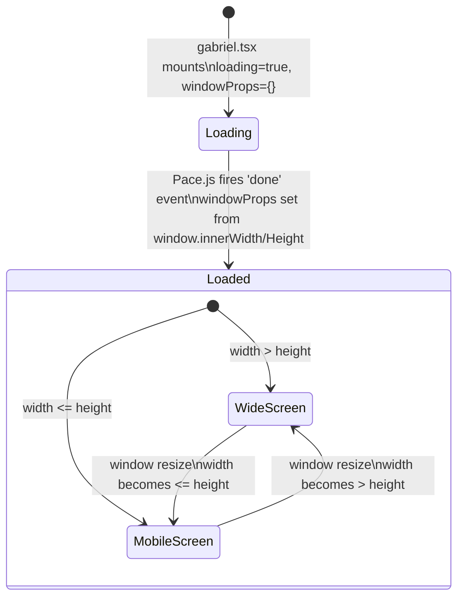
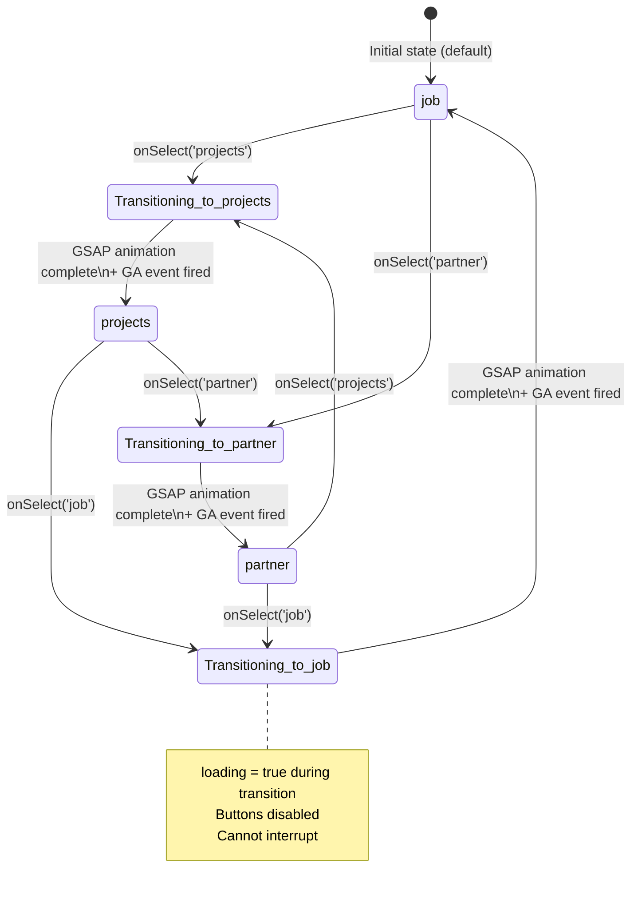
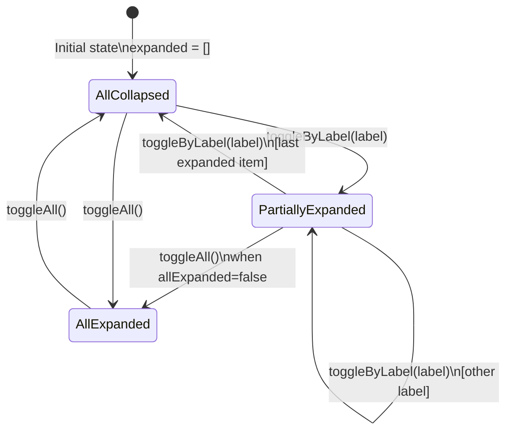
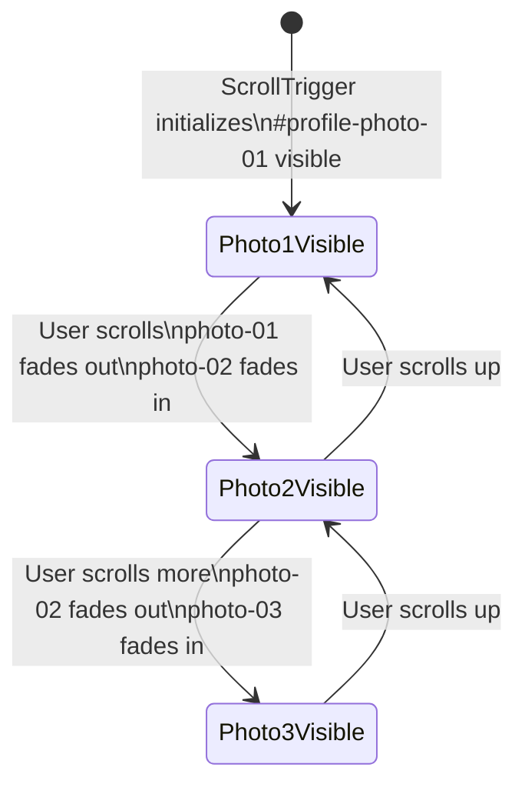
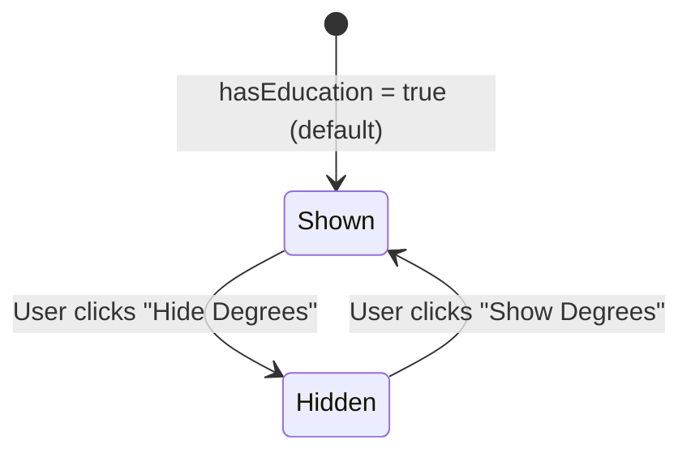

# State Machines — fullstack-profile

> Generated by Reversa Detective · 2026-05-17
> Confidence: 🟢 CONFIRMED | 🟡 INFERRED

---

## 1. Page Loading State Machine

Controls whether the hero and content render or stay hidden. Driven externally by Pace.js.

**States:**
| State | `loading` | `windowProps` | Hero visible? |
|-------|-----------|---------------|--------------|
| Loading | `true` | `{}` | No (hidden) |
| Loaded/WideScreen | `false` | `{ width, height }`, width > height | Yes — WideScreen |
| Loaded/MobileScreen | `false` | `{ width, height }`, width ≤ height | Yes — Mobile |

**Trigger:** `Pace.on('done', callback)` — external CDN library event. 🟢

---

## 2. Tab Selection State Machine (`hero-dark`)

Controls which panel is displayed in the profile section.

**States:**
| State | `selected` | `loading` | Panel shown |
|-------|-----------|-----------|-------------|
| `job` | `'job'` | `false` | Jobs (work history timeline) |
| `projects` | `'projects'` | `false` | Projects (accordion) |
| `partner` | `'partner'` | `false` | FuturePartner (recruiter message) |
| `Transitioning_*` | previous value | `true` | Previous panel (fading out) |

**Transition duration:** GSAP `stagger: 0.05 × n elements` + `scrollTo` animation 🟢

---

## 3. Project Accordion State (`hero-dark/Projects`)

Controls which projects show their full detail.

**Note:** Due to duplicate `label = "requirement"` in data, toggling any "requirement" project transitions 5 projects simultaneously. 🔴

**Transition animation:** Tailwind CSS `max-h-0` → `max-h-screen` (CSS transition, no JS animation) 🟢

---

## 4. Profile Photo Carousel (scroll-driven, not stateful)

This is not a React state machine but a GSAP scroll-driven sequence. Documented here for completeness.

**Photos sequence:**
1. `gabriel-photo.png` — professional photo
2. `gabriel-github.png` — GitHub avatar
3. `gabriel-photo.jpg` — alternate professional photo

**Trigger:** GSAP ScrollTrigger on `#profile-photo` element, `scrub:1`, `start:'top center'`, `end:'10% 10%'` 🟢

---

## 5. Education Visibility Toggle

Simple two-state toggle within the Jobs component.

**Effect:** Hides/shows the UNINOVE (2008–2010) and FATEC (2010–2013) education timeline entries. 🟢
